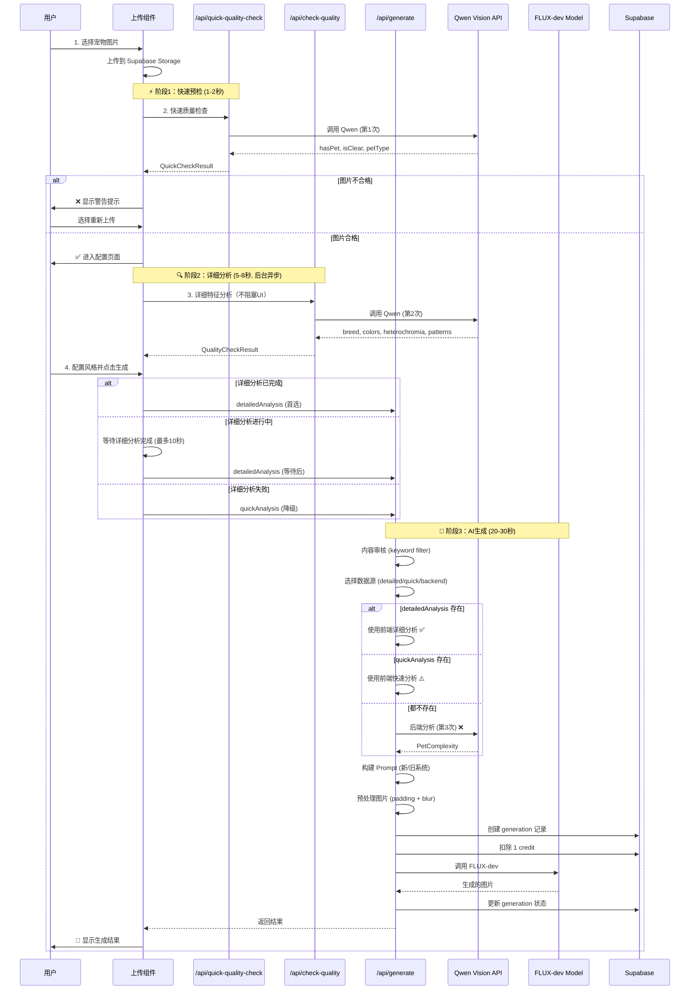

# 图片生成工作流完整文档

> **重要：修改任何生成相关代码前必读此文档！**
> 
> 本文档描述了从用户上传图片到生成完成的完整工作流，包含所有API调用、数据流转和关键决策点。

---

## 🎯 工作流概览



---

## 📊 API 职责矩阵

| API端点 | 职责 | Qwen调用 | 响应时间 | 阻塞UI | 数据返回 |
|---------|------|----------|----------|--------|----------|
| `/api/quick-quality-check` | 快速预检：是否有宠物、是否清晰 | ✅ 第1次 | 1-2秒 | ✅ 阻塞 | `QuickCheckResult` |
| `/api/check-quality` | 详细分析：品种、颜色、异瞳、花纹 | ✅ 第2次 | 5-8秒 | ❌ 不阻塞 | `QualityCheckResult` |
| `/api/generate` | 生成图片：审核→分析→生成→保存 | ⚠️ 仅fallback | 20-30秒 | ✅ 阻塞 | 生成的图片URL |

---

## 🔍 Qwen 调用规则（关键！）

### ✅ 正常情况：2次调用

```typescript
// 第1次：快速预检（前端）
/api/quick-quality-check → Qwen
作用：筛选不合格图片
返回：{ hasPet, isClear, petType: "dog" }

// 第2次：详细分析（前端）
/api/check-quality → Qwen
作用：获取详细特征用于prompt构建
返回：{ breed, colors, heterochromia, patterns, ... }
```

### ❌ 异常情况：3次调用（需避免！）

```typescript
// 问题：前端 detailedAnalysis 为 null
/api/generate 收到 null → 后端重新调用 analyzePetFeatures() → 第3次调用 ❌

// 原因：
1. 用户点击太快（详细分析未完成）
2. /api/check-quality 失败
3. 前端未正确传递 detailedAnalysis
```

### 🎯 优化方案：智能混合策略

```typescript
// 三级数据源优先级
1. detailedAnalysis（前端详细分析）✅ 首选
   → 最准确，包含所有信息
   
2. quickAnalysis（前端快速分析）⚠️ 降级
   → 基础信息，足够大部分场景
   
3. Backend Fallback（后端重新分析）❌ 最后保底
   → 仅在前端完全失败时使用
   → 记录错误日志
```

---

## 📦 关键数据结构

### QuickCheckResult（快速检查结果）

```typescript
interface QuickCheckResult {
  hasPet: boolean          // 是否检测到宠物
  isClear: boolean         // 图片是否清晰
  petType: string          // 宠物类型（通用）："dog", "cat", "bird"
  quality: 'good' | 'poor' // 整体质量
}

// 使用场景：
// - 快速筛选不合格图片
// - 作为 QualityCheckResult 的降级方案
```

### QualityCheckResult（详细分析结果）

```typescript
interface QualityCheckResult {
  isSafe: boolean                    // 内容安全检查
  unsafeReason: string               // 不安全原因
  hasPet: boolean
  petType: string                    // 具体类型："Golden Retriever"
  quality: 'excellent' | 'good' | 'poor' | 'unusable'
  issues: string[]                   // 问题列表
  
  // 🎨 详细特征（用于Prompt构建）
  hasHeterochromia: boolean          // 是否异瞳
  heterochromiaDetails: string       // "left blue, right brown"
  breed: string                      // 品种
  complexPattern: boolean            // 是否有复杂花纹
  multiplePets: number               // 宠物数量
  detectedColors: string             // 检测到的颜色
}

// 使用场景：
// - 传递给 /api/generate 作为 detailedAnalysis
// - 用于构建精确的prompt
```

### PetComplexity（后端内部使用）

```typescript
interface PetComplexity {
  petType?: string              // 从 detailedAnalysis 或 quickAnalysis 映射
  detectedColors?: string
  hasHeterochromia: boolean
  heterochromiaDetails: string
  complexPattern: boolean
  patternDetails: string
  multiplePets: number
  breed: string
  keyFeatures: string
}

// 使用场景：
// - /api/generate 内部统一的数据格式
// - 由 mapDetailedAnalysis() 或 mapQuickAnalysis() 转换而来
```

---

## 🔄 数据流转链路

```
用户上传
  ↓
[1] Upload to Supabase Storage
  ↓
[2] Quick Check → QuickCheckResult
  ├─ 保存到 state: quickAnalysisResult
  └─ 用户看到：✅ 检测到狗狗
  ↓
[3] Detailed Analysis (异步) → QualityCheckResult
  ├─ 保存到 state: detailedAnalysisResult
  └─ 用户看到：品种、颜色等详细信息
  ↓
[4] User clicks Generate
  ├─ 智能等待：如果 detailed 未完成，等待最多10秒
  ├─ 传递数据：detailedAnalysis (首选) 或 quickAnalysis (降级)
  └─ 调用 /api/generate
  ↓
[5] Backend Processing
  ├─ 选择数据源：detailed > quick > backend fallback
  ├─ 映射为 PetComplexity
  ├─ 构建 Prompt
  └─ 调用 FLUX
  ↓
[6] 返回结果给用户
```

---

## ⚠️ 修改代码时的检查清单

### 修改前端代码时

- [ ] 是否影响 `quickAnalysisResult` 或 `detailedAnalysisResult` 的保存？
- [ ] 是否影响数据传递到 `/api/generate`？
- [ ] 是否需要更新 `waitForDetailedAnalysis` 逻辑？
- [ ] 是否影响用户等待时间？
- [ ] 错误处理是否完善？（分析失败时的降级）

### 修改后端代码时

- [ ] 是否影响 Qwen 调用次数？
- [ ] `detailedAnalysis` 和 `quickAnalysis` 参数是否正确接收？
- [ ] 三级数据源策略是否完整？（detailed → quick → backend）
- [ ] 是否记录了数据来源到 metadata？
- [ ] 是否有足够的日志用于监控？
- [ ] Feature Flag 是否正确判断？（新/旧 prompt 系统）

### 修改 Prompt 系统时

- [ ] 新系统和旧系统是否都正确处理 `petComplexity`？
- [ ] `petType` 来源是否正确？（应从 `detailedAnalysis.petType` 获取）
- [ ] 是否考虑了 `quickAnalysis` 降级场景的 prompt 质量？
- [ ] 负面 prompt 是否正确传递？

---

## 🐛 常见Bug和解决方案

### Bug 1: Qwen被调用3次

**症状：**
```
日志显示：
⚡ Quick Check (第1次)
🔍 Detailed Analysis (第2次)
❌ Backend Analysis Fallback (第3次) ← 不应该出现！
```

**原因：**
- 前端 `detailedAnalysis` 为 `null`
- 后端收到空值后重新调用 `analyzePetFeatures()`

**解决方案：**
1. 检查前端是否正确保存 `detailedAnalysisResult`
2. 检查是否正确传递到 `/api/generate`
3. 确保 `waitForDetailedAnalysis` 逻辑生效
4. 如果 detailed 失败，应传递 `quickAnalysis` 作为降级

---

### Bug 2: 用户点击太快导致分析未完成

**症状：**
```
用户上传图片 → 0.5秒后点击生成
后端收到：detailedAnalysis = null
```

**原因：**
- 详细分析需要 5-8 秒
- 用户在分析完成前点击了生成按钮

**解决方案：**
```typescript
// 前端添加智能等待
const handleGenerate = async () => {
  if (isDetailedAnalysisRunning) {
    showToast("正在分析宠物特征，请稍候...")
    await waitForDetailedAnalysis(10000)  // 最多等10秒
  }
  
  if (detailedAnalysisCompleted) {
    // 使用 detailedAnalysis
  } else {
    // 降级到 quickAnalysis
  }
}
```

---

### Bug 3: petType 不一致

**症状：**
```
前端显示：Golden Retriever
后端使用：dog
生成结果：通用狗狗（不准确）
```

**原因：**
- `quickAnalysis.petType = "dog"` (通用)
- `detailedAnalysis.petType = "Golden Retriever"` (具体)
- 后端错误使用了 quick 的数据

**解决方案：**
```typescript
// 后端必须优先使用 detailedAnalysis
const finalPetType = detailedAnalysis?.petType || quickAnalysis?.petType || 'pet'
```

---

## 📈 监控指标

### 关键指标

| 指标 | 目标值 | 监控方法 |
|------|--------|----------|
| Qwen 调用次数/生成 | ≤ 2次 | 日志统计 `dataSource` 字段 |
| Backend fallback 率 | < 1% | 统计 `dataSource === 'backend'` |
| Quick 降级率 | < 5% | 统计 `dataSource === 'quick'` |
| 用户等待时间 | ≤ 10秒 | 前端 timing 日志 |
| 生成成功率 | > 99% | 统计 status === 'succeeded' |

### 日志示例

```typescript
// 后端记录数据来源
console.log('✅ Using frontend detailed analysis')  // 正常
console.warn('⚠️ Detailed analysis unavailable, using quick analysis')  // 降级
console.error('❌ No frontend analysis provided, running backend analysis')  // 异常

// 数据库 metadata 记录
{
  analysisDataSource: 'detailed',  // 或 'quick' 或 'backend'
  completedAt: '2026-01-20T10:30:00Z'
}
```

---

## 🚀 性能优化建议

### 已实施

- ✅ 快速预检先于详细分析（减少无效分析）
- ✅ 详细分析异步执行（不阻塞UI）
- ✅ 前端数据传递到后端（避免重复调用）
- ✅ 三级降级策略（确保成功率）

### 未来可优化

- 🔄 图片哈希缓存（相同图片不重复分析）
- 🔄 并行化上传和分析（减少串行等待）
- 🔄 使用更快的轻量级模型做预检（降低成本）
- 🔄 WebSocket 实时反馈（提升体验）

---

## 🔗 相关文件

### 前端

- [`components/upload-modal-wizard.tsx`](../components/upload-modal-wizard.tsx)
  - `performQualityCheck()` - 快速检查
  - `performDetailedAnalysis()` - 详细分析
  - `handleGenerate()` - 生成逻辑

### 后端 API

- [`app/api/quick-quality-check/route.ts`](../app/api/quick-quality-check/route.ts)
  - 快速质量检查（第1次 Qwen）
  
- [`app/api/check-quality/route.ts`](../app/api/check-quality/route.ts)
  - 详细特征分析（第2次 Qwen）
  
- [`app/api/generate/route.ts`](../app/api/generate/route.ts)
  - 主生成流程
  - `analyzePetFeatures()` - 后端 fallback（第3次 Qwen）
  - 三级数据源策略

### Prompt 系统

- [`lib/prompt-system/`](../lib/prompt-system/)
  - `parser.ts` - 解析 user/qwen/style prompt
  - `conflict-cleaner.ts` - 冲突检测和清理
  - `prompt-builder.ts` - 构建最终 prompt

### 配置

- [`lib/feature-flags.ts`](../lib/feature-flags.ts)
  - `USE_NEW_PROMPT_SYSTEM` - 新/旧 prompt 系统切换
  - `DISABLE_CONFLICT_CLEANING` - 冲突清理开关

---

## 📝 变更历史

| 日期 | 变更内容 | 影响 |
|------|----------|------|
| 2026-01-20 | 创建工作流文档 | 建立规范 |
| 2026-01-20 | 实施智能混合方案 | Qwen 调用从 2-3次 → 稳定2次 |

---

## ❓ FAQ

**Q: 为什么需要两次 Qwen 调用？能否合并为一次？**

A: 设计权衡：
- 快速预检（1-2秒）可以立即阻止不合格图片，避免浪费用户时间
- 详细分析（5-8秒）在后台进行，不阻塞用户配置风格
- 如果合并，用户需要等待 8-10秒才能看到任何反馈（体验差）

**Q: 什么情况下会触发后端 fallback？**

A: 仅在以下情况：
1. 前端两次分析都失败
2. 前端数据传递错误（代码bug）
3. 网络问题导致前端请求失败

正常情况下应该 < 1% 触发率。

**Q: 如何判断是否需要重构？**

A: 监控指标：
- 如果 Backend fallback 率 > 5%：需要检查前端稳定性
- 如果 Quick 降级率 > 20%：需要优化详细分析速度或超时策略
- 如果用户投诉"分析太慢"：考虑使用更快的模型

---

**最后更新：** 2026-01-20  
**维护者：** 开发团队  
**联系方式：** 通过 GitHub Issues 报告问题
