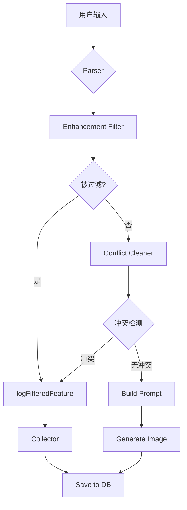

# 被过滤特征数据收集指南

## 📊 目的

收集用户生成过程中被过滤掉的特征数据，用于Phase 2分析和优化冲突检测规则。

---

## 🎯 核心问题

**我们需要回答**：
1. 冲突检测是在帮助用户，还是在阻碍用户？
2. 哪些用户输入最常被过滤？
3. 是否应该调整"增强模式"允许的特征类型？
4. FLUX 模型是否足够智能，可以直接处理冲突提示词？

---

## 🔧 系统架构

### 数据收集流程



### 3种过滤原因

| Reason | 说明 | 示例 |
|--------|------|------|
| `enhancement_mode_filter` | 增强模式过滤掉的基础特征 | 用户输入"golden fur"被过滤 |
| `conflict_detected` | 冲突检测解决的冲突 | "Samoyed" vs "Dalmatian" |
| `breed_association` | 品种关联清理 | Dalmatian失败 → 移除"dalmatian spots" |

---

## 📈 数据分析查询

### 1. 查看最近30天统计（使用视图）

```sql
SELECT * FROM filtered_features_stats
ORDER BY count DESC;
```

**输出示例**：
```
feature_type | filter_reason           | feature_source | count | unique_users
-------------|-------------------------|----------------|-------|-------------
color        | enhancement_mode_filter | user           | 45    | 12
breed        | conflict_detected       | qwen           | 23    | 8
pattern      | breed_association       | qwen           | 15    | 5
```

---

### 2. 最常被过滤的用户输入

```sql
SELECT 
  original_user_input,
  filter_reason,
  COUNT(*) as occurrences,
  COUNT(DISTINCT user_id) as unique_users
FROM filtered_features_log
WHERE filter_reason = 'enhancement_mode_filter'
  AND created_at >= NOW() - INTERVAL '30 days'
GROUP BY original_user_input, filter_reason
ORDER BY occurrences DESC
LIMIT 20;
```

**用途**：发现用户最想做但被系统阻止的事情

**可能的发现**：
- "golden fur" (15次) → 用户想改变毛色
- "blue eyes" (12次) → 用户想改变眼睛颜色
- "make it cuter" (8次) → 模糊的风格调整

---

### 3. 冲突模式分析

```sql
SELECT 
  feature_type,
  conflict_with_type,
  COUNT(*) as conflict_count,
  array_agg(DISTINCT feature_value) as common_features
FROM filtered_features_log
WHERE filter_reason = 'conflict_detected'
  AND created_at >= NOW() - INTERVAL '30 days'
GROUP BY feature_type, conflict_with_type
ORDER BY conflict_count DESC;
```

**用途**：了解哪些特征类型最容易冲突

---

### 4. 按风格分析

```sql
SELECT 
  style_id,
  filter_reason,
  COUNT(*) as count
FROM filtered_features_log
WHERE created_at >= NOW() - INTERVAL '30 days'
GROUP BY style_id, filter_reason
ORDER BY style_id, count DESC;
```

**用途**：某些风格是否更容易触发过滤？

---

### 5. 用户行为分析

```sql
WITH user_filter_stats AS (
  SELECT 
    user_id,
    COUNT(*) as total_filters,
    COUNT(DISTINCT generation_id) as affected_generations,
    array_agg(DISTINCT filter_reason) as reasons
  FROM filtered_features_log
  WHERE created_at >= NOW() - INTERVAL '30 days'
  GROUP BY user_id
)
SELECT 
  total_filters,
  COUNT(*) as user_count,
  AVG(affected_generations::float / total_filters) as avg_filters_per_generation
FROM user_filter_stats
GROUP BY total_filters
ORDER BY total_filters DESC;
```

**用途**：用户是否反复遇到过滤问题？

---

## 🧪 A/B 测试

### 启用自由模式（无冲突检测）

在 Vercel 环境变量中设置：
```
NEXT_PUBLIC_DISABLE_CONFLICT_CLEANING=true
```

**建议**：
1. 只对5-10%的流量启用
2. 运行1周
3. 对比两组数据：
   - 生成质量评分
   - 用户满意度
   - 重新生成率

---

## 📊 Phase 2 决策指标

收集100次生成后，检查以下指标：

| 指标 | 阈值 | 行动 |
|------|------|------|
| 被过滤特征占比 | > 20% | 考虑放松规则 |
| 用户重复输入相同内容 | > 30% | 系统未理解用户意图 |
| 冲突检测误判率 | > 15% | 优化冲突规则 |
| `enhancement_mode_filter` 占比 | > 50% | 扩展允许的特征类型 |

---

## 🔍 实际案例分析

### 案例1：用户想改变帽子颜色

**日志**：
```json
{
  "feature_type": "color",
  "feature_value": "green hat",
  "filter_reason": "enhancement_mode_filter",
  "original_user_input": "green hat",
  "style_id": "Christmas-Vibe"
}
```

**问题**：用户合理需求被过滤
**解决**：已修复（配饰词优先级提升）

---

### 案例2：品种冲突

**日志**：
```json
{
  "feature_type": "breed",
  "feature_value": "Samoyed",
  "filter_reason": "conflict_detected",
  "conflict_with_value": "Dalmatian",
  "original_user_input": "golden Samoyed"
}
```

**分析**：用户上传斑点狗，但想要萨摩耶
**问题**：这是合理的吗？还是用户误解了系统功能？

---

## 🎯 决策树

```
100次生成数据收集完成
    │
    ├─> enhancement_mode_filter > 50%
    │   └─> 考虑扩展允许的类型（如允许颜色微调）
    │
    ├─> conflict_detected冲突误判率 > 15%
    │   └─> 优化冲突检测规则
    │
    ├─> A/B测试：无冲突检测质量更好？
    │   └─> 考虑移除冲突检测（方案B）
    │
    └─> 数据表明当前设计合理
        └─> 保持现状，继续收集数据
```

---

## 🚀 下一步

1. ✅ **已完成**：数据收集系统上线
2. ⏳ **进行中**：收集100次生成数据
3. 📊 **待办**：运行上述SQL查询分析
4. 🧪 **待办**：A/B测试（可选）
5. 🎯 **待办**：基于数据做决策

---

## 🔗 相关文件

- **Database Schema**: `/supabase/migrations/20260118_create_filtered_features_log.sql`
- **Conflict Cleaner**: `/lib/prompt-system/conflict-cleaner.ts`
- **API Integration**: `/app/api/generate/route.ts`
- **Feature Flags**: `/lib/feature-flags.ts`

---

## 📞 联系

如需数据分析支持或有问题，请：
1. 查看 Supabase Dashboard → `filtered_features_log` 表
2. 运行 `SELECT * FROM filtered_features_stats;`
3. 检查 Vercel 日志中的 `📊 Data Collection` 信息
